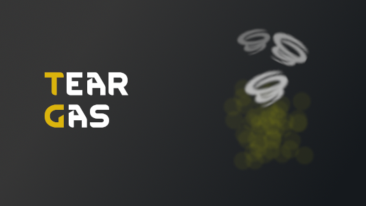
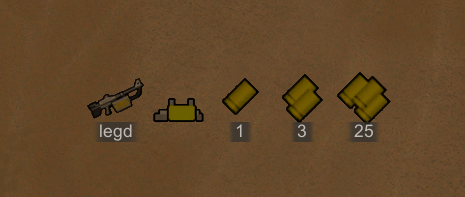
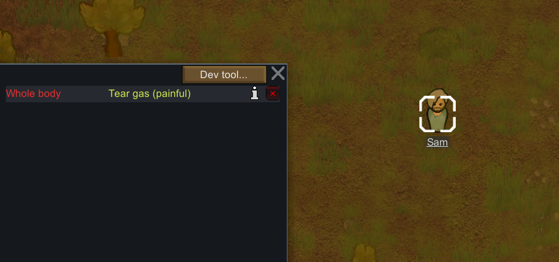
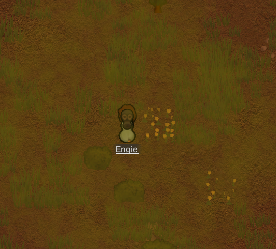

# NachoToast / RimWorld / Tear Gas

A simple mod that adds a form of tear gas to RimWorld.

This utilizes my [Simple Custom Gas Framework](https://github.com/NachoToast/SimpleCustomGasFramework).

Find it [here](https://steamcommunity.com/sharedfiles/filedetails/?id=2999466026) on the Steam workshop.

