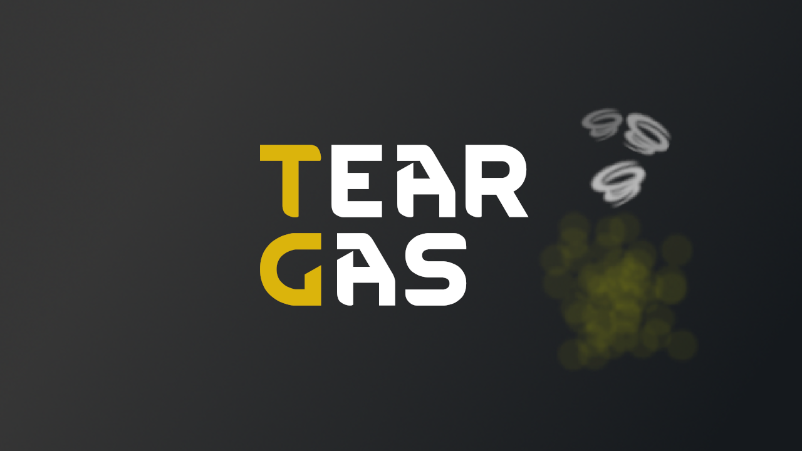

# RimWorld / Tear Gas 

A simple mod that adds a form of tear gas to RimWorld.

Find it [here](https://steamcommunity.com/sharedfiles/filedetails/?id=2999466026) on the Steam workshop.

This utilizes my [Simple Custom Gas Framework](https://github.com/NachoToast/SimpleCustomGasFramework).

See also:

- [Gas vents](https://github.com/NachoToast/RimWorldGasVents)
- [Knockout gas](https://github.com/NachoToast/RimWorldKnockoutGas)
- [Mustard gas](https://github.com/NachoToast/RimWorldMustardGas)

